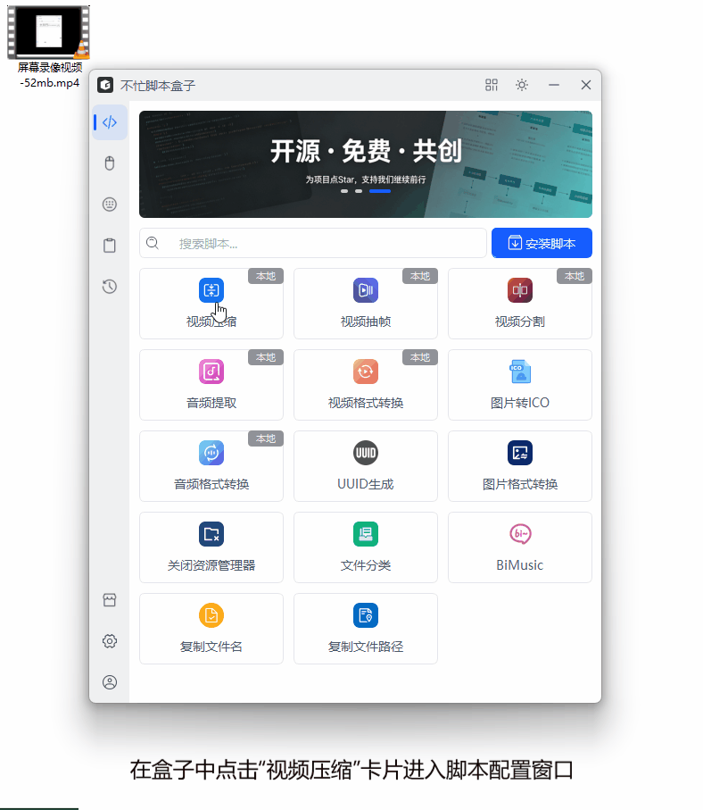

# 视频压缩脚本

一键压缩视频文件、大幅减小体积，统一输出 MP4(H.264)，基于 FFmpeg 引擎，支持批量处理。

---

## 脚本 简介

本工具提供一个简洁的图形配置界面，让您轻松配置压缩参数。配置完成后，在文件资源管理器中选中视频文件，右键即可一键完成压缩。

### ✨ 核心特性

- **统一输出 MP4**：所有视频压缩后均输出 MP4(H.264)，兼容性最佳
- **右键菜单集成**：配置一次，永久生效。选中视频 → 右键 → 一键压缩
- **批量处理**：支持同时选中多个视频文件批量压缩
- **自定义输出目录**：可指定输出位置，留空则保存到原文件所在目录
- **压缩强度可调**：轻度 / 标准 / 高效 / 强力 / 极致 5 档（CRF 20~38）
- **分辨率可调**：原始 / 1080p / 720p / 480p（等比缩放，进一步减小体积）
- **音频码率可调**：192k / 128k / 96k / 64k（重新编码为 AAC 降码率）
- **安全输出**：源文件为 MP4 时输出 `_compressed` 后缀文件，绝不动原文件
- **智能跳过**：已存在的文件自动跳过（可开启覆盖）
- **元数据保留**：自动保留原文件标题、编码信息等元数据
- **实时进度**：压缩过程中实时显示百分比与已编码时长

---

## 脚本演示

---

## 安装方法

* 通过不忙脚本盒子安装（推荐）
  
  * 下载并安装 [不忙脚本盒子](https://www.bm-box.cn)
  
  * 打开不忙脚本盒子 → **脚本市场** → 搜索 **「视频压缩」**
  
  * 点击「安装」

* 手动运行（有编程基础用户）
  
      # 1. 安装 FFmpeg（ffmpeg 命令需在 PATH 中可用）
      # https://ffmpeg.org/download.html
      # 2. 配置python环境
      uv venv
      uv sync
      # 3. 启动脚本
      python main.py                # 启动配置界面（无参数）
      python main.py <参数JSON路径>  # 带参数启动（用于右键调用）

✅ 推荐使用不忙脚本盒子安装、盒子会自动为脚本配置环境、依赖、ffmpeg环境变量、并提供右键、快捷键执行脚本的能力

---

## 启动方式

通过不忙脚本盒子安装后，可通过以下方式使用「视频压缩」功能：

* 配置参数（首次使用或需修改配置时）
  
  * 打开「不忙脚本盒子」
  
  * 点击「视频压缩」进入配置窗口
  
  * 根据需求设置转换参数
  
  * 点击「保存配置」

* 执行音频格式转换（日常使用）
  
  * 在文件管理器中选中视频文件
  
  * 右键点击，选择「视频压缩」
  
  * 脚本自动按保存的配置执行视频压缩

* 快捷键操作
  
  * 为脚本设置全局快捷键
  
  * 选中视频后按下快捷键即可快速执行

✅ 配置保存后永久生效，无需每次重复设置

🔄 仅在需要更改参数时才需重新进入配置窗口

         

